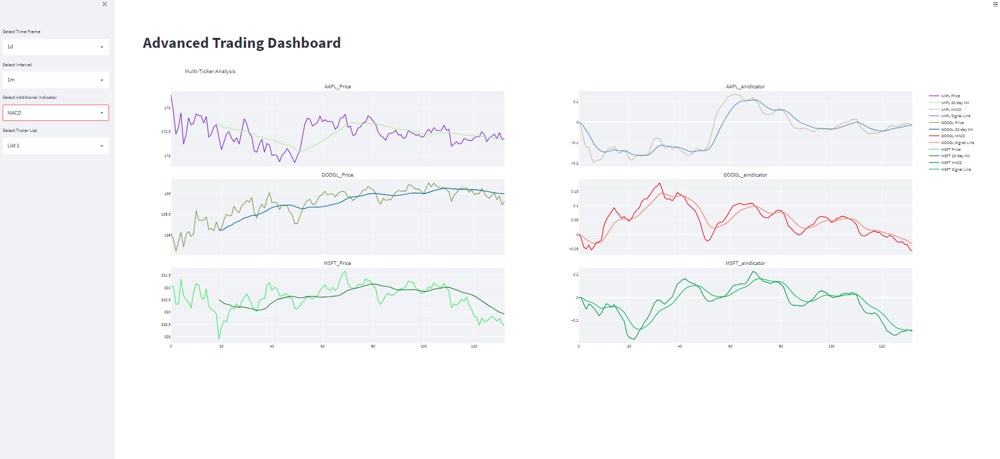
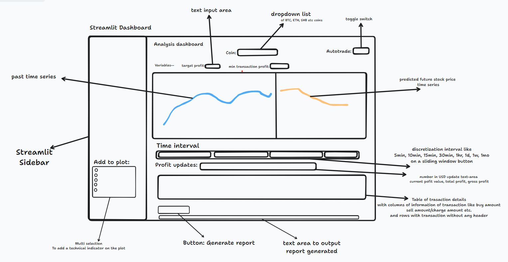

# Streamlit Dashboard with AI Integration

This project showcases a Streamlit dashboard integrated with AI for advanced trading analysis. It includes real-time predictions, technical indicators, and decision-making screens for tabular data.

## Components
- **Technical Indicators w. Time Series**: Analyzes financial data with various technical indicators.
- **Change Window Range**: Interactive time window adjustment for in-depth analysis.
- **Real-Time Prediction**: AI-powered predictions on market trends.
- **Decision Screen for Tabular Data**: Presents actionable insights in a tabular format.
- **Portfolio Summary**: Overview of your current portfolio status.
- **Portfolio Enhance**: Suggestions for portfolio optimization.
- **Other Additional Informative Graphs**: Additional graphs providing deeper insights.

## How to Run
```bash
streamlit run app3.py
```

# Demo and Screenshots
## Early Dashboard Demo
To see the early version of the dashboard:


## Screenshots and Videos

### Dashboard Screenshot

### Feature Video



# Code Snippets
Below are some key snippets from the project:

```
import streamlit as st
import pandas as pd
# ... rest of the imports ...

# Placeholder for your predictive model function
def predictive_model():
    # Implement your predictive model here
    return np.random.random()

# ... rest of the code ...

```


For more detailed information, please refer to the source code in this repository.

# Contributing

Contributions to this project are welcome. Please refer to the `CONTRIBUTING.md` file for guidelines.

# License
This project is licensed under the terms of the MIT license.


### Notes:
- Replace the URLs in the markdown with the actual links to your hosted files.
- You can host your image directly on GitHub by uploading it to your repository and linking to it.
- For videos, consider converting them to GIFs if they are short and embedding them directly in the README, or else host them externally and provide links as shown above.


We will use priority queue to prioritze which transactions to execute given the p

given that,  without modifying the solver find an algorithm to use the transactions and store but and take the decision at the current timestamp like buy sell or hold. Because with every new transactions most of the buys are happening at timestamp 0 as its the lowest in price and there are duplicate transactiosn. When doing in real time we cannot change the transactions made in then past, or cannot redo a transaction in the past as its all about the current time. 
write the advanced logic

make it suited for real time. 
remember we are optmizing for current time decision for optimal profit 

should we do a priority queue? or what does more make sense. 
write come math related to this that proves how to do it in real time

---
Why a Priority Queue?
Dynamic Decision-Making: The priority queue dynamically ranks transactions based on their profitability (or another criterion like risk-adjusted returns), allowing the algorithm to adapt as market conditions change.

Handling Overlapping Transactions: In scenarios where multiple transactions might be profitable, a priority queue helps select the one that offers the best return or fits best within your risk parameters.

Real-Time Adaptability: As new price data comes in, the priority queue can be updated in real-time, adding or removing transactions based on their viability.
---


is it possible to run the same to find out the window and k transactions that can be done on the next timestep to put that on the queue?
TThe global number of transactions can be set to K_hat = 10 over 30 minutes of trading. So the remaining time of trading, the target profit in the time interval are some optimizing variables here. I think finding the optimal window size given the current timestamp data removes one optimality variable. Explain this in math

How to decide when it is a good time to execute the transaction? which timestamp? As we dont have the futures. 
In the case that we have predictions for the next 15 timestamps, how can this aid in deciding when to execute the transactions given the past transcations, queue, past history, remaining time for execution and remaning transactions

Think about 
Influence on Transactions: Use the predictions to adjust the perceived profitability of each potential transaction. For instance, if a future predicted price suggests a high selling price, it increases the attractiveness of buying now.
that incorportaes the logic related to this in the current code 

---

Mathematical Formulation:
Profit Calculation with Predictions:

Traditional Profit: 
Profit
trad
=
Selling Price
−
Buying Price
Profit 
trad
​
 =Selling Price−Buying Price
Adjusted Profit with Prediction: 
Profit
adj
=
Predicted Selling Price
−
Current Price
Profit 
adj
​
 =Predicted Selling Price−Current Price
Incorporating Predictions:

Modify the transaction selection criteria to incorporate predicted future prices.
The weightage given to predictions can depend on their confidence or accuracy level.
Decision Criteria:

Select transactions based on a combination of historical data and future predictions.
Use a scoring function that considers:
Traditional profit based on historical data.
Adjusted profit based on predictions.
Time remaining for trading and remaining transaction quota (K_hat).
Execution Strategy:

Continuously evaluate the transaction queue.
Decide to execute a transaction if:
The predicted future price suggests a significant profit.
There's sufficient confidence in the prediction.
Executing the transaction aligns with the remaining time and K_hat.
Algorithm Outline:
Initialize: Set up a priority queue for transactions. Maintain a balance between historical data and future predictions.

At Each Timestep:

Update the Solver with current prices.
Generate potential transactions.
For each transaction, calculate the adjusted profit using predictions.
Add the transaction to the queue with its adjusted profit as the priority.
Queue Management:

Re-evaluate transactions in the queue at each timestep.
Adjust priorities based on new predictions or changes in the market.
Transaction Execution:

Execute transactions from the queue considering the adjusted profit, prediction confidence, and K_hat.
Update K_hat after each executed transaction.

Mathematical Justification:
By using future predictions to adjust the profit calculations, you're essentially incorporating expected future market conditions into your current decision-making process.
The reliability of this approach heavily depends on the accuracy of the predictions. Incorrect predictions can lead to suboptimal decisions.
A balance needs to be maintained between reacting to real-time market data and speculative actions based on predictions.

---

considering the algorithm of the solver used and how we are using the transactions, finding window and using queue to execute, 
derive the associated risk indicating reliability of the transactions along the predictions. and a metric that indicates the perceived profitability in the given timeframe. This will help in triggering stop whenever the profitability drops or there are higher losses in the observed timeframe. 

---

The integration of Risk Indicator and Perceived Profitability provides a more nuanced view of each transaction's potential, considering both market volatility and predictive insights. This approach allows for dynamic adjustment of trading strategy in real-time, potentially enhancing profitability while managing risk.
---


given input data at current time
given past data find the optimal window size 
using window find transaction that includes the current timestamp, see what profitble transactions was missed and save that weigh buying or selling at current based on it
further check transaction with risk, predictions related risk
using checks and weighing all of them decide to execute trade at current or hold - its stochastic in nature 
find out the aftereffects and consequence of the decision action, reset weights 
 